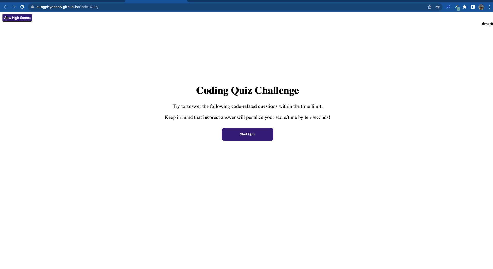

## Code-Quiz

## Table of Contents
- [General info](#general-info)
- [Tasks Completed](#TaskCompleted)
- [Links](#Links)
- [Screenshot](#Screenshot)
- [License](#license)
- [Credits](#credits)

## General-info

In this project, I created a code quiz application that includes the combination of multiple-choice questions and interactive coding challenges.

## Tasks Completed

- Start button for code quiz
- Timer starts when presented the questions
- Another question will present when answered the question
- Used local storage to save the score and user's initials
- Added comments in the script.js / css

## Links

Website URL     -  https://aungphyohan5.github.io/Code-Quiz/

Repository URL  -  https://github.com/Aungphyohan5/Code-Quiz

## Screenshot

## License

MIT

## credits

- W3school (https://www.w3schools.com/)

